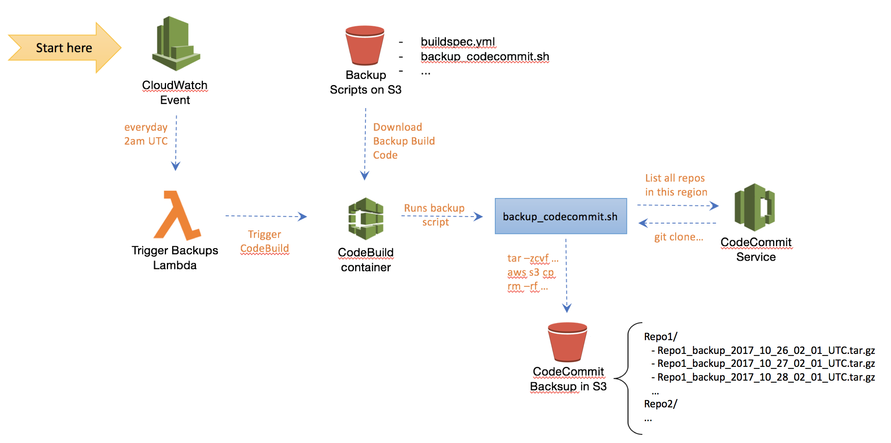

# Introduction

[AWS CodeCommit](https://aws.amazon.com/codecommit/) is a fully-managed source control service that makes it easy for companies to host secure and highly scalable private Git repositories. CodeCommit eliminates the need to operate your own source control system or worry about scaling its infrastructure. You can use CodeCommit to securely store anything from source code to binaries, and it works seamlessly with your existing Git tools.

You typically don't need to worry about backing up your CodeCommit repositories as CodeCommit's architecture is highly scalable, redundant, and durable. However, there are situations where backups might be helpful. For instance, if one accidentally deletes the CloudFormation stack that created the CodeCommit repository, the entire repository and its contents
are also deleted for good. Oops. 

As per [AWS documentation](https://aws.amazon.com/codecommit/faqs/): _"Deleting an AWS CodeCommit repository is a destructive one-way operation that cannot be undone. To restore a deleted repository, you will need to create the repository again and use either a backup or a local copy from a full clone to upload the data_". 

So, having a backup handy is not a bad idea - Better safe than sorry!

# The Solution

This project offers a serverless CodeCommit backup solution (who wants to manage servers these days?) that uses an Amazon CloudWatch event rule as a trigger (eg, trigger the backup every day at 2am UTC). (See the figure below for details). The CloudWatch event targets an AWS Lambda function that simply triggers an AWS CodeBuild container that generates a backup of all AWS CodeCommit repositories within a particular AWS account and region. The backup consists of .tar.gz files named after the repository's name and using a timestamp (eg, Repo1_2017_10_01_02_00). The backups are stored in a designated S3 bucket (eg, backup-bucket/Repo1, backup-bucket/Repo2, etc). One can use S3 lifecycle events to automatically move old backups into Amazon Glacier (cold storage) or alternatively specify an expiration policy for backup files in S3 to have them deleted after a certain period of time. Also
as a security best practice, the S3 bucket storing the backups should enable [default encryption](https://aws.amazon.com/blogs/aws/new-amazon-s3-encryption-security-features/).



# Deploying the Solution

* Clone this project in your local workstation (only tested on Mac OS)
* Make sure you have the latest version of the [AWS Command Line Interface](http://docs.aws.amazon.com/cli/latest/userguide/installing.html) installed in your local box
* Make sure the user in your AWS profile have permissions to create IAM roles, CloudWatch Event rules, CodeBuild projects and Lambda functions at a minimum (check your profiles under ~/.aws/credentials)
* Open script ./deploy.sh and update these parameters as desired: AWS profile, S3 buckets, and backup schedule. The S3 buckets
will not be created. They must exist already. (See parameters below.)

```bash
aws_profile="default"                  # default AWS profile (or choose another profile)
backup_schedule="cron(0 2 * * ? *)"    # backups scheduled for 2am UTC, everyday
scripts_s3_bucket="[S3-BUCKET-FOR-BACKUP-SCRIPTS]s" # bucket must exist in the SAME region the deployment is taking place
backups_s3_bucket="[S3-BUCKET-FOR-BACKUPS" # bucket must exist and have no policy that disallows PutObject from CodeBuild
stack_name="codecommit-backups"        # CloudFormation stack name for the solution
```

* By default, all CodeCommit repositories within the AWS region where the solution was deployed to will be backed up everyday at 2am UTC `(cron(0 2 * * ? *))` into the S3 bucket specified
* Run script ./deploy.sh to deploy the solution into your AWS account

```bash
  chmod +x ./deploy.sh
  ./deploy.sh
```

## License Summary

This sample code is made available under the MIT-0 license. See the LICENSE file.
